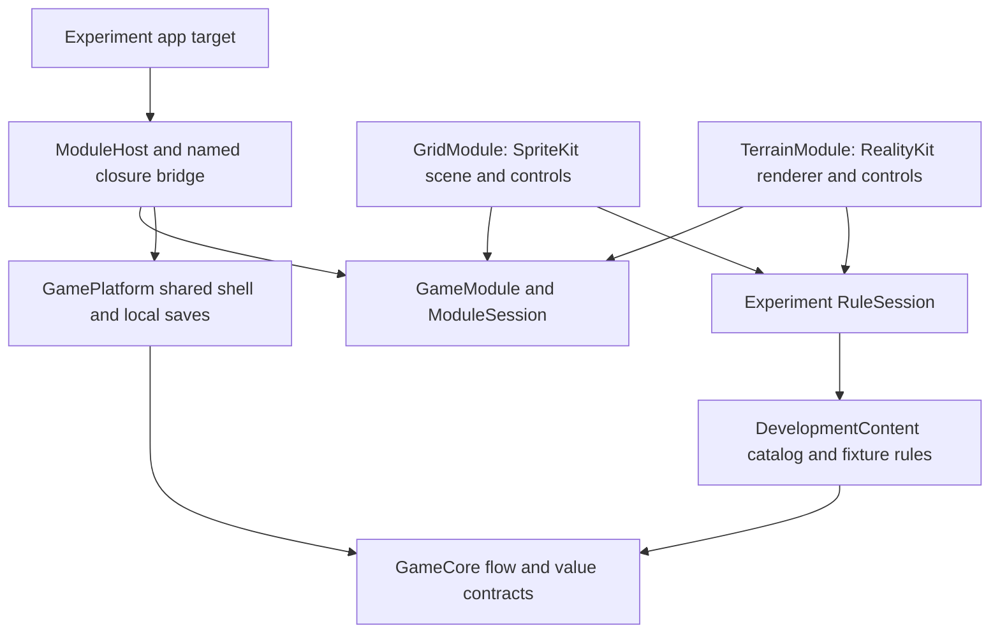

# Game-module seam experiment

This disposable [Spike 06](../../roadmap/spikes/06-module-seam.md) registers two small mobile modules with the existing shared shell: a SpriteKit block grid and a RealityKit terrain placeholder. It tests whether shell services can remain shared while each module retains its simulation, renderer, hit testing and controls. The [decision](../../roadmap/decisions/ADR-006-game-module-seam.md) records the contract and its limits.

**Verification status:** seven focused checks passed per target (six app-hosted tests and one native interaction/relaunch test), using one disposable iPhone 12 on iOS 26.0 with Xcode 27.0. Each target built with the other module removed; owned-device shutdown and deletion succeeded. See the [receipt](evidence/focused-receipt.json) and [audit](../../roadmap/audits/spike-06-module-seam.md). This is not a full device matrix, hosted mobile acceptance, macOS work or a promoted production module API.

## Registration and ownership

`GameModule` is an experiment-local `@MainActor` protocol with associated `Session: ModuleSession`, `Gameplay: View` and `Controls: View` types. A module supplies its retained session, display name, registration version, concrete views and reduced-motion behavior. `ModuleHost<Module>` registers that concrete module at compile time. `ModuleSeamApp` chooses `GridModule` or `TerrainModule` through the target's compilation condition; there is no runtime plugin discovery.

`ModuleSession` exposes preparation and beginning for a `LoadRequest`, input activation, preferences, explicit failure, a request-bound outcome callback and a progress-recording callback. It does not expose cells, scene nodes, entities or physics. The two studies currently share experiment-owned `RuleSession` and the existing pure fixture rules; an independent session fixture checks that the host does not require that implementation.

The named `ControllerReference` bridge adapts these methods to the existing `ShellController` closures. Its weak controller reference becomes available after initialization; preparation captures the current request, settings delivery deduplicates equal values, and completion passes the originating request back to the controller. The production `ShellController` source remains unchanged.

Both apps load original `DevelopmentContent` resources: `block-sample-01` or `dig-sample-01`, with catalog title ID `development-practice`. The generated targets have separate bundle identifiers and app containers, so they independently store this same title namespace. This demonstrates two independently removable renderer targets using one sample catalog; it does not establish production registration of unrelated titles or cross-title migration.

The modules own simulation and deterministic input traces, rendering, hit conversion, any physics they introduce, accessible controls and genre-specific UI. Grid retains one `SKScene`; terrain retains one RealityKit renderer with a virtual camera, without camera tracking. Frame callbacks do not advance the fixture rules. Touch and accessible buttons call the same gated session input method. Shared shell services own menus, lifecycle pauses, preferences, audio/haptics and persistence. Reduced-motion delivery is present; these studies have no decorative animation to measure.



The renderer dependencies stop in their module directories. No `SKScene`, RealityKit entity or Metal type enters the registration/session protocols or shared packages.

## Generate and verify

Run these commands from the repository root. Generation needs Python; native verification needs Xcode and an available iOS simulator runtime. Generation changes only the experiment project and schemes.

```sh
# Include both removable module targets (the default).
python3 experiments/module-seam/scripts/generate-project.py
python3 experiments/module-seam/scripts/generate-project.py --modules both --check

# Generate either target with the other renderer's sources excluded.
python3 experiments/module-seam/scripts/generate-project.py --modules grid
python3 experiments/module-seam/scripts/generate-project.py --modules terrain

# Restore the checked-in two-target project after manual selection.
python3 experiments/module-seam/scripts/generate-project.py --modules both

# Check orchestration with mocked commands (no native processes).
python3 experiments/module-seam/scripts/test-verifier.py

# Focused serial verification; choose a new evidence directory.
python3 experiments/module-seam/scripts/verify.py /private/tmp/gamecore-module-seam-evidence
```

The verifier selects the newest available iOS runtime, creates one owned iPhone 12, generates and builds each module separately, and runs its app-hosted contract tests plus one native renderer-input/relaunch smoke test. It retains logs, result summaries, project hashes and experiment Swift/Python source hashes, restores the two-target project and attempts owned-device shutdown/deletion. Inspect the resulting receipt and cleanup logs before treating a run as passed. It does not rerun the repository's full foundation matrix. Future runs must confirm their actual runtime from the receipt; runtime selection is not pinned by the script.

Tests cover sample identity, paused/background input gating, settings and reduced-motion delivery, failure without completion, superseded preparation, unsupported registration, stale outcome rejection, selected-level progress and preference restoration. The UI smoke routes one real renderer contact through the session and completes the selected sample before relaunch. These are tiny fixture studies, not full puzzle or terrain games, renderer performance benchmarks or save crash-durability tests.

## Evolving the contract

Registration version 1 is accepted before preparation. An unsupported version fails loading; it is never silently treated as version 1. This version is separate from level `schemaVersion`/`contentVersion` and save `schemaVersion`.

If a future source registration adds a capability, introduce a named adapter such as `ModuleV2ToV1Adapter` only when it can preserve the older behavior, and test that behavior explicitly. Otherwise reject the registration until the host supports it. No adapter is implemented here, and registration changes do not imply rewriting level IDs or migrating saves. Promote a shared API only after a second real title demonstrates the same need.

The recorded native run predates the verifier’s before/after source comparison and cleanup exit-status improvements. Its hashes were captured after the run while Swift inputs were frozen; the current app/test sources match them. Four mocked orchestration checks validate the final verifier without additional simulator runs. Full native verification of that final orchestration version was not repeated.
