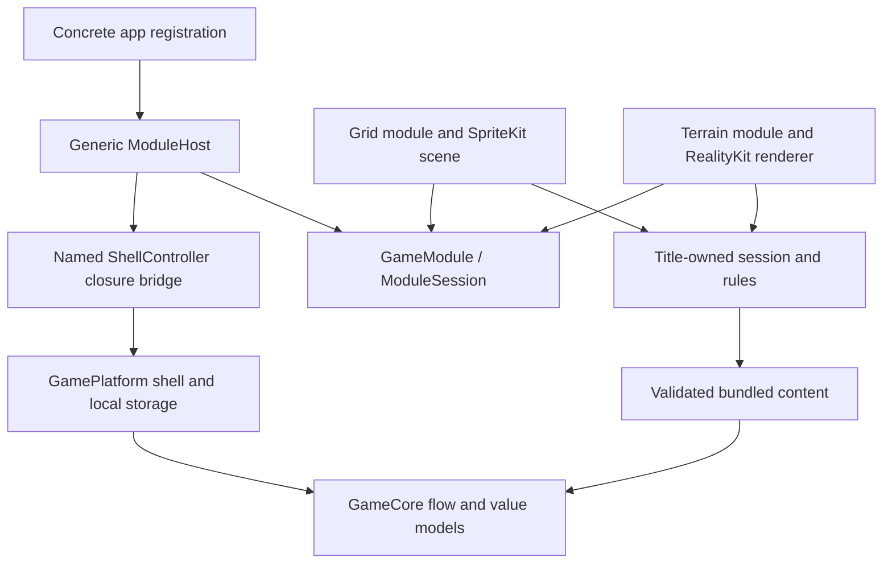

# ADR-006 — Game-module registration seam

**Date:** 2026-10-04. **Status:** Accepted for the experiment; focused native verification passed. Experiment only, not a production API promotion.

## Context

[Spike 06](../spikes/06-module-seam.md) asks how a 2D puzzle and a terrain game can share app services without sharing their renderers or simulations. The existing `ShellController` already provides a closure seam for loading, session activation, reduced motion and progress. We need a small registration shape that groups those responsibilities and permits separate targets, without adding engine types to `GameCore` or `GamePlatform`.

The [experiment](../../experiments/module-seam/README.md) supplies a SpriteKit block grid and a RealityKit terrain placeholder. Both select original levels from the existing `development-practice` catalog and use its pure deterministic fixture rules. They run in different app bundles/containers. They are two renderer studies using one title catalog, not proof of independent production-title registration, complete games or different production simulations.

## Decision

Use an experiment-local, compile-time `@MainActor GameModule` protocol with associated session and SwiftUI view types. A concrete module supplies `Session: ModuleSession`, `Gameplay: View`, `Controls: View`, a display name, a registration version, view factories and reduced-motion handling. `ModuleHost<Module>` retains the concrete module; the generated app target selects it at compile time. No type-erased renderer, runtime discovery or universal entity API is introduced.

`ModuleSession` contains only demonstrated shell behavior: prepare and begin with a `LoadRequest`, activate/deactivate input, receive preferences, emit a request-bound success/failure, trigger explicit failure and record a successful level in progress. The associated type permits a title-owned session different from the experiment's `RuleSession`. A separate test fixture exercises that independence. Pure rules and content identities remain below the renderer.

The host uses a named `ControllerReference` compatibility bridge to the existing closure-based `ShellController`. The bridge avoids dereferencing a controller before initialization, prepares the captured request and forwards outcomes with their originating token. The controller remains responsible for rejecting stale outcomes and invalidating sessions on navigation or destructive storage actions. Settings are delivered from the published flow with duplicate values removed. No production controller source changes are required.

Keep these capabilities title-owned: simulation, deterministic input traces, physics, scene/entity ownership, rendering, hit testing, accessible gameplay controls and genre-specific UI. Shared shell services retain menus, lifecycle pauses, preferences, audio/haptics and local persistence. Each module retains its own renderer across view updates. No SpriteKit, RealityKit or Metal type appears in either protocol or shared core services.

## Alternatives

Explicit closures alone preserve the existing shell's small dependency surface and remain its implementation boundary. They become repetitive when every app must separately wire preparation, activation, settings, outcomes and concrete views. The narrow protocol groups that wiring and permits a reusable typed host while leaving those closures intact.

A narrow protocol with associated views and session types gives compile-time registration and permits distinct implementations without renderer conversion. Its cost is a generic host and source-level coordination when requirements change. Keep it experiment-local until real titles justify promotion.

Runtime plugins, universal scene/entity protocols and a shared renderer factory would require discovery, type erasure, engine-neutral hit/physics representations and capability negotiation. Neither prototype demonstrates those needs or a reduction in code. Reject that design rather than hiding engine-specific behavior behind a speculative common renderer.

## Version and migration rule

Registration `contractVersion` is a source-integration version, independent of content envelope versions and save schema versions. The current host accepts version 1 before preparing the module. Unknown versions fail loading with an explicit message; the host must not silently ignore unfamiliar capabilities or downgrade the registration.

A future version 2 may use a named `ModuleV2ToV1Adapter` only if its required behavior can be represented by version 1, with tests for the translation and rejected unsupported capabilities. Otherwise introduce an explicitly versioned host and require the app registration to opt into it. That adapter is an example, not implemented infrastructure. Preserve stable level IDs; content and save migrations continue under their own contracts and are not triggered by changing this registration version.

## Evidence and limits

The initial focused serial verification passed seven tests per target: six app-hosted seam tests and one real renderer-contact/relaunch test. Grid-only and terrain-only generated configurations built successfully on one owned iPhone 12 simulator (iOS 26.0/23A5287g, Xcode 27.0/27A266a). Shutdown/deletion and project restoration succeeded. Both summaries show zero failures, skips, expected failures and runtime warnings. Commands, counts and source-hash timing limits are retained in the [receipt](../../experiments/module-seam/evidence/focused-receipt.json) and [audit](../audits/spike-06-module-seam.md).

The tests are designed to check loading, request races, pause/background gates, settings, reduced motion, success/failure, late outcomes, selected-level persistence and restoration. Native SpriteKit touch and RealityKit entity hit conversion passed in that initial focused run. Final review corrected cancelled-before-entry preparation so it cannot erase a newer staged load; one targeted regression passed on the final Swift sources with unchanged before/after hashes and successful owned cleanup. The original fourteen checks were not repeated after that one-line guard. There is no full mobile matrix, hosted acceptance, physical-device requirement, macOS target, frame-rate study, full game or production module API claim. The independent-session fixture establishes only the tested seam behavior; both rendered studies still share one tiny rule implementation and catalog.

Promoting the protocol later requires evidence from real title requirements. This decision does not require a renderer abstraction, a shared physics system or a runtime plugin architecture.
